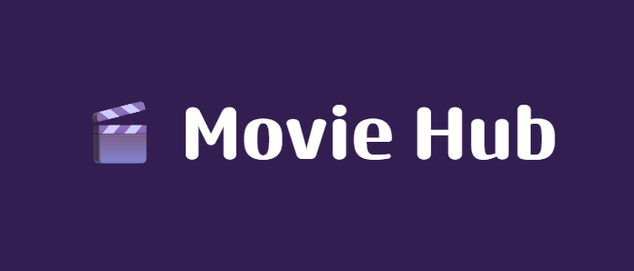

 # Banner do Logo / Titulo do Projeto:
   - Se já não tiver, usar site **https://banner.godori.dev/** para criar o banner.
   - Fazer download do banner (usar altura pequena).
   - Colocar na pagina assets ou img do projeto.
   - Referenciar no MarkDown:
     

#

 Colocar Badges (opcional/mais profissional):
  - Usar site **http://shields.io**
  - Procurar badge na lupa
  - Copiar badge
  - Colocar no codigo:
    
  - **Repositório precisa ser publico**

#

Descrição clara e objetiva do projeto.

#

GIF do projeto em execução (utilidade bem especifica).

#

## 🚀 Features:
- Create
- Read
- Update
- Delete

## 💻 Stack:
- React: Framework...
- Typescript: Linguagem derivada do JavaScript...
- Axios: Auxiliar requisições...

## 📦 Instalação:

 - ### ⚠️ Pré-Requisitos:
   Certifique-se que você tem instalado:
   
   <a href="https://www.npmjs.com/">
    
   </a>
   <a href="https://nodejs.org">
    
   </a>

 - ### 🧭 Guia de Uso:

   <ol>
    <li> Clonar</li>
       
       ```bash
       git clone https://github.com/erickcarpes/erickcarpes.git
       ```
       
    <li>Navegar</li>
   
    <li>Rodar</li>
   </ol>

## ⚖️ Licença (uso profissional, precisa escolher licença certinho):
 - The MIT License (MIT) 2017 - Athitya Kumar. Please have a look at the LICENSE.md for more details.
